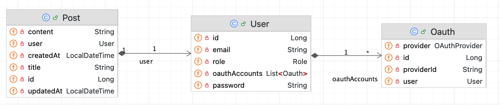
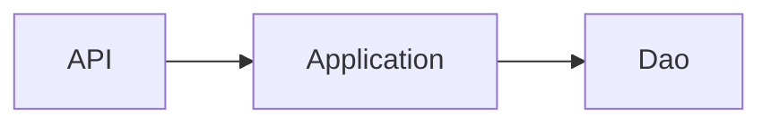
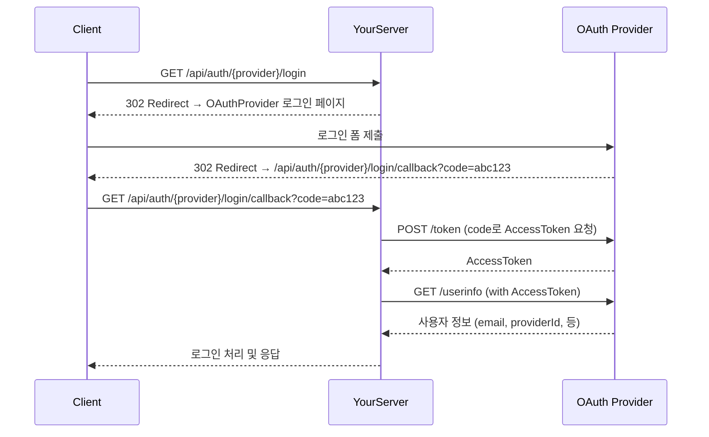
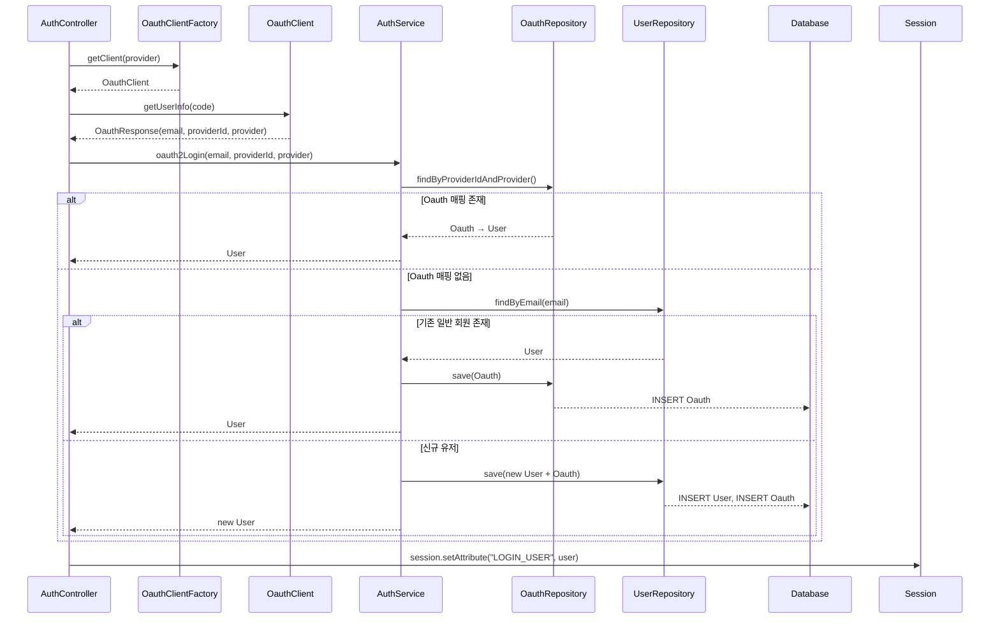

# Simple blog

Jpa, Jdbc를 이용하여 간단한 블로그를 개발합니다.

## Feature

- OAuth2 login 구현
- KAKAO API, GOOGLE API
- User data는 memory H2 기반으로 저장됩니다.
- 시스템의 인증은 쿠키와 세션 기반으로 인증됩니다.
- 로그인한 회원 정보 조회
- 게시글 생성 수정 삭제 조회 (❌ 별도의 페이징은 구현하지 않았습니다)

## Required

- Java 21
- Gradle
- Kakao Developer Account
- Google Developer Account

## Setup

### 1. Google, Kakao Oauth 클라이언트 생성

### 2. Application Properties 설정

`application.properties` 에 네이버와 구글의 비밀 키 입력

```properties
# Kakao Oauth 설정
oauth2.kakao.auth-server-base-url=https://kauth.kakao.com
oauth2.kakao.resource-server-base-url=https://kapi.kakao.com
oauth2.kakao.client-id=
oauth2.kakao.redirect-uri=http://localhost:8080/api/auth/kakao/login/callback
# Google OAuth 설정
oauth2.google.base-url=https://accounts.google.com/o/oauth2/v2/auth
oauth2.google.redirect-uri=http://localhost:8080/api/auth/google/login/callback
oauth2.google.client-id=
oauth2.google.client-secret=
```

## Running the Application

1. 어플리케이션 시작

```bash
chmod +x run.sh
./run.sh
```

2. H2데이터베이스 확인 http://localhost:8080/h2-console

- url: `jdbc:h2:mem:testdb`

3. 카카오 소셜 로그인 엔드포인트 http://localhost:8080/api/auth/kakao/login

4. 구글 소셜 로그인 엔드포인트 http://localhost:8080/api/auth/google/login

### Model



### Project Layer



### Oauth Login Flow



### Multi Oauth Login Flow

